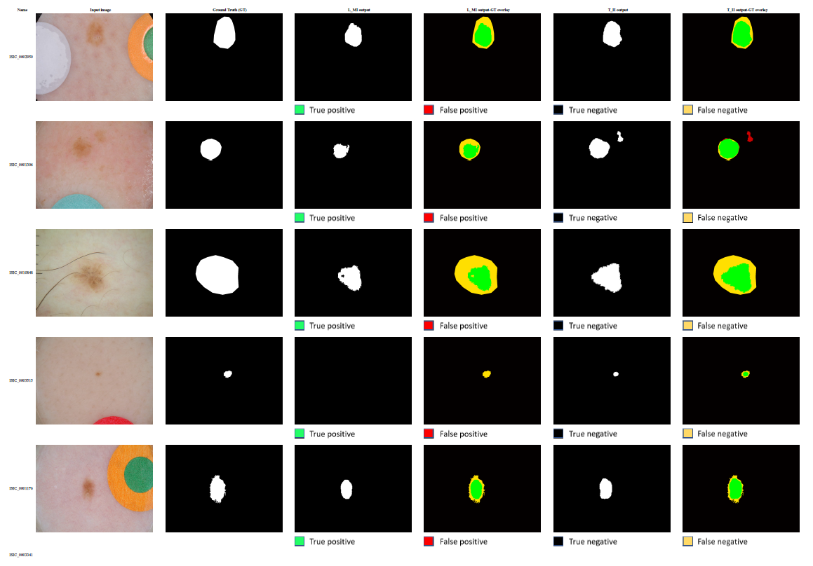
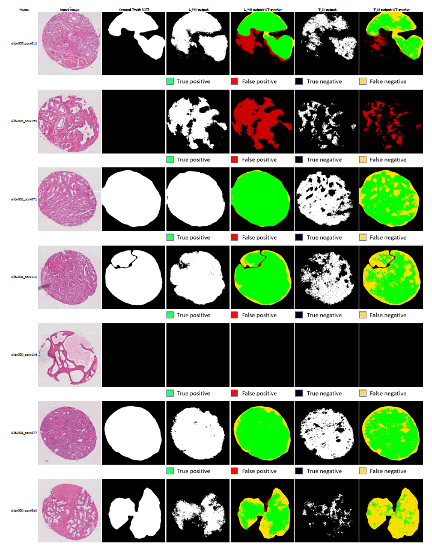
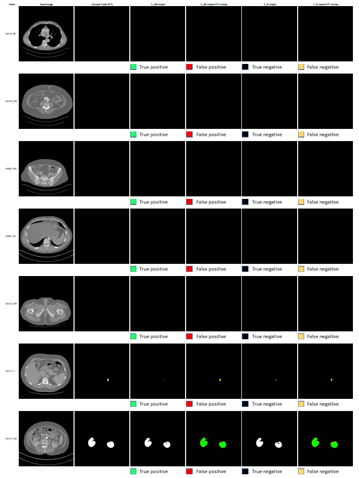
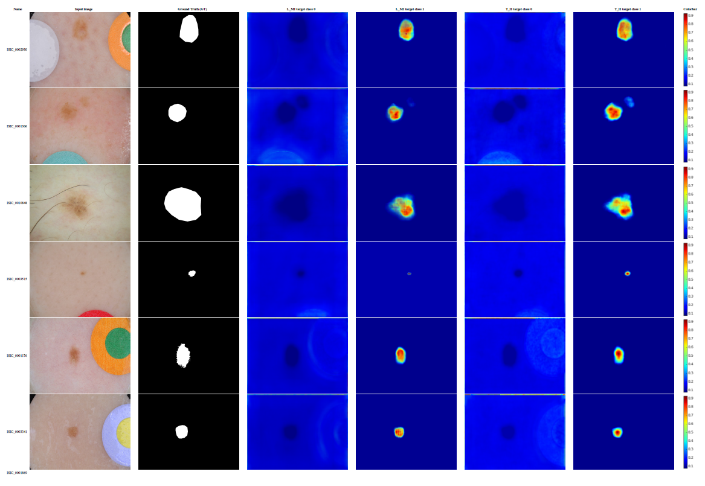
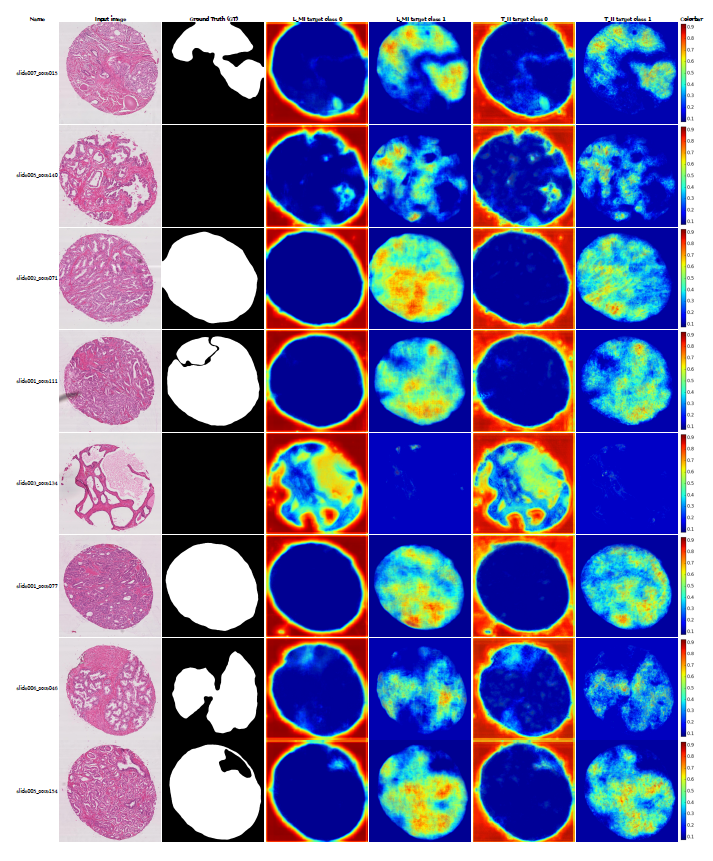

# Generalizable multi-model deep learning toolkit with statistical estimations, visualizations and interpretation for segmentation of medical images

## Index:

1. Data can be obtained at: https://drive.google.com/drive/folders/1i_NB7PhOATj91o7jJeWdM7zo4Lj43-EC?usp=sharing
2. Trained Models can be obtained at: https://drive.google.com/drive/folders/1sRJQwbmRxUVm2wl2ZoloGA9S4hBiZFYP?usp=sharing
3. The codes for training and evaluation of trained models can be obtained at: https://drive.google.com/drive/folders/1zb9pO21DQKVo8RkiRIeWUGQ5BTkiZA1W?usp=sharing

## Gallery of model outputs: 

###  and  model outputs and comparison with clinical ground-truths for all test images for the Skin, Prostate core biopsy and Kidney CT datasets are provided as follows (Files are too big to be previewed on browser. Please download from the provided Google Drive link):

- Skin images:
  - https://drive.google.com/file/d/16YdVNVcZ0Fa7Zq7gOQq56gDZ8KQAfEup/view?usp=sharing
  
- Prostate core biopsy images:
  - https://drive.google.com/file/d/102LRp1FEjayKebO5dJ8xT6h8n0yhEfgt/view?usp=sharing
  
- Kidney CT images:
  - https://drive.google.com/file/d/19kzl9F3cvqvCsLuQpMxyfCH8xAIa0P33/view?usp=sharing
  

###  and  model GradCAM outputs for all test images for the Skin, Prostate core biopsy and Kidney CT datasets are provided as follows (Files are too big to be previewed on browser. Please download from the provided Google Drive link):

- Skin images:
  - Part 1: https://drive.google.com/file/d/1gewhaQtXfiPanvRSz6hTeD37fr9EZm03/view?usp=sharing
  - Part 2: https://drive.google.com/file/d/1Ff3t09n7ztI2dLdaEVQzHQp9IciNGA8W/view?usp=sharing
  
- Prostate core biopsy images:
  - https://drive.google.com/file/d/1RKGUH7SJ60uYTygFqxLYzNL3IfZQmcA6/view?usp=sharing
  
- Kidney CT images:

### NOTE: Trained  and  models and associated data and code provided through the links above, will be made publicly available upon publication of manuscript.

